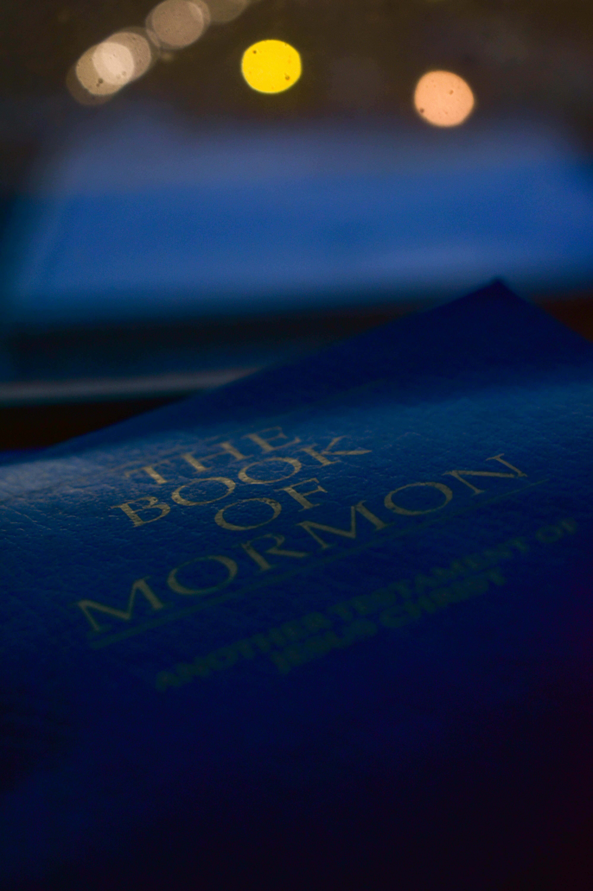

[](https://book-of-mormon-tan.vercel.app/)

# 📖 Book of Mormon Reader

**🔗 Live app:** [https://book-of-mormon-tan.vercel.app/](https://book-of-mormon-tan.vercel.app/)

A beautiful, responsive **Next.js** web app for reading the **Book of Mormon** (LDS Missionary Edition, 2025). Browse all books and chapters, search every verse, and switch between warm **beige** and **dark brown** themes.

---

## ✨ Features

- 📚 **15 books** — Small Plates & Mormon’s Record, with clear chapter navigation
- 🔢 **Verse numbering** — Show or hide verse numbers while you read
- 🔍 **Full-text search** — Find words across all chapters and jump straight to results
- 🌓 **Light & dark themes** — Beige gradients (light) and dark brown gradients (dark)
- 📱 **Fully responsive** — Sidebar menu on desktop, mobile-friendly navigation
- ✨ **Polished UI** — Lucide icons, Playfair Display & Merriweather typography, linear gradients

---

## 📜 Source text

Content is extracted from the **Missionary Edition** (The Church of Jesus Christ of Latter-day Saints, 2025 print), using `book_of_mormon_missionary_english.pdf` in the project root.

Standard **LDS chapter and verse numbering** (239 chapters, ~6,600 verses). Text is produced by `scripts/extract-missionary.py` via `pdftotext`, with footnote markers and column artifacts cleaned where possible.

---

## 🚀 Getting started

### Prerequisites

- **Node.js** 18+ (20+ recommended for latest Next.js)
- **pdftotext** (poppler-utils) — only if re-extracting from the PDF

### Install & run

```bash
git clone https://github.com/raimonvibe/book-of-mormon.git
cd book-of-mormon
npm install
npm run dev
```

Open [http://localhost:3000](http://localhost:3000).

### Re-extract from PDF

Place `book_of_mormon_missionary_english.pdf` in the project root, then:

```bash
npm run extract
```

This regenerates `data/book-of-mormon-data.json` and `data/search-index.json`.

The legacy Lamoni Edition extractor is still available as `npm run extract:lamoni` (requires `bookofmormon00lamo_bw.pdf`).

### Production build

```bash
npm run build
npm start
```

---

## 🗂️ Project structure

```
book-of-mormon/
├── app/                 # Next.js App Router (pages, API, styles)
├── components/          # UI: hero, menu, reader, search, theme
├── data/                # Extracted scripture JSON + search index
├── public/mormon.jpg    # Cover image (hero, loading, social preview)
├── scripts/             # PDF extraction script (Python)
└── package.json
```

---

## 🛠️ Tech stack

- [Next.js](https://nextjs.org/) 14 · React 18 · TypeScript
- [Tailwind CSS](https://tailwindcss.com/)
- [Lucide React](https://lucide.dev/) icons

---

## 📄 License

MIT © [raimonvibe](https://github.com/raimonvibe)

See [LICENSE](LICENSE) for details.
